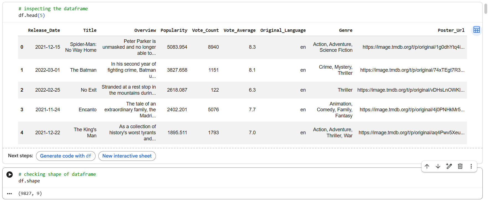
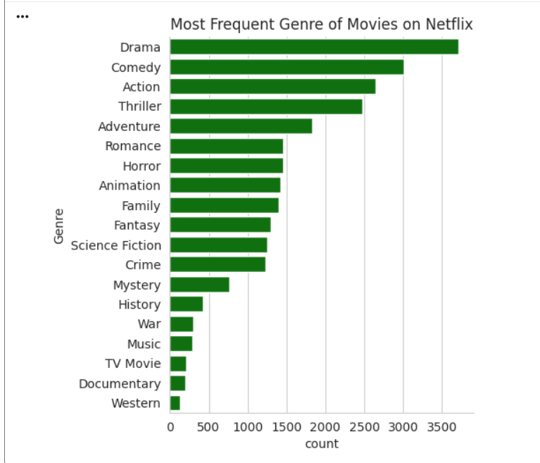
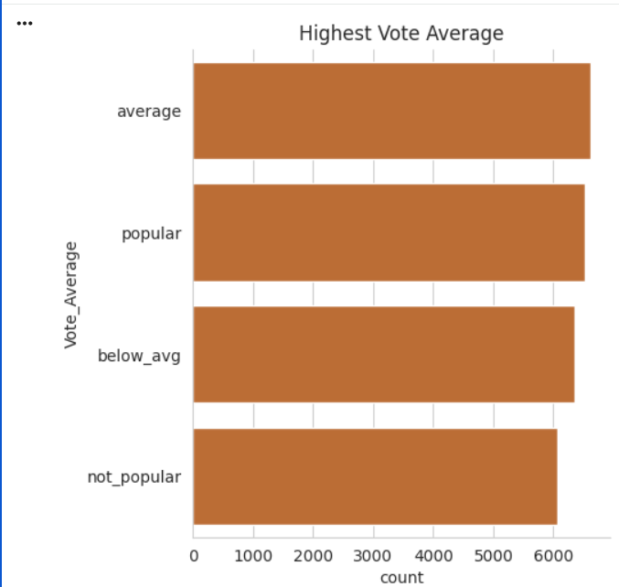
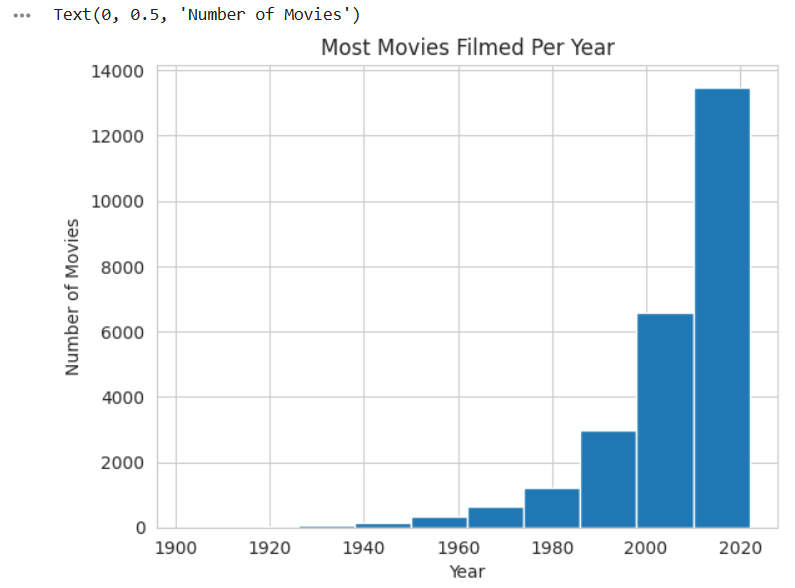

# Netflix Data Analysis (Exploratory Data Analysis)

A Python-based Exploratory Data Analysis (EDA) project exploring movie metadata, release-year trends, genre distribution, popularity, and audience vote averages.

> **Note:** This project analyzes the provided `mymoviedb.csv` dataset. The project folder and notebook use a Netflix-related name, but this does not by itself establish that the dataset represents Netflix's complete or official catalog.

## Project Overview

The goal of this project is to clean and explore movie data, summarize useful patterns, and communicate findings through visualizations.

### Objectives
- Inspect the dataset's structure and summary statistics.
- Prepare release dates and derive release years.
- Group audience vote averages into rating categories.
- Expand comma-separated genres so genre frequencies can be analyzed.
- Visualize genre distribution, vote averages, popularity, and release-year patterns.

## Tools and Libraries

- Python
- Pandas
- NumPy
- Matplotlib
- Seaborn
- Jupyter Notebook / Google Colab

## Files in This Repository

| File | Description |
|---|---|
| `NETFLIX_DATA_ANALYSIS.ipynb` | Notebook containing the EDA workflow and code |
| `mymoviedb.csv` | Dataset used by the notebook |
| `dataframe.png` | Screenshot or image of the processed dataframe |
| `FrequentGenre.png` | Genre-frequency visualization |
| `HighestVoteAvg.png` | Vote-average visualization |
| `MostMoviesPerYear.png` | Release-year visualization |
| `movie_data_analysis_project_ppt.pptx` | Project presentation |
| `README.md` | Project documentation |

## Dataset

The initial dataset contains **9,827 rows and 9 columns**:

- `Release_Date`
- `Title`
- `Overview`
- `Popularity`
- `Vote_Count`
- `Vote_Average`
- `Original_Language`
- `Genre`
- `Poster_Url`

The notebook removes `Original_Language`, `Overview`, and `Poster_Url` for its analysis, converts `Release_Date` to a date field, and extracts the release year.

## Data Preparation

The notebook performs the following steps:

1. Loads the CSV file into a Pandas DataFrame.
2. Checks dataset dimensions, data types, missing values, and duplicate rows.
3. Removes columns not used in the analysis.
4. Converts release dates and extracts the year.
5. Categorizes `Vote_Average` into four groups: `not_popular`, `below_avg`, `average`, and `popular`.
6. Splits comma-separated genres into separate rows and removes rows without a genre.

**Important:** After splitting genres, the dataset has **25,552 genre-level rows**. This is not the number of unique movies: a movie with multiple genres appears in multiple rows.

## Key Findings

- **Most frequent genre:** Drama, with 3,715 genre-level records in the notebook's genre-frequency analysis.
- **Highest popularity in the dataset:** *Spider-Man: No Way Home* (2021), with a popularity score of approximately **5,083.954**.
- **Vote-average categories:** The notebook's initial categorization counts are `not_popular` (2,467), `popular` (2,450), `average` (2,412), and `below_avg` (2,398).
- **Release-year trend:** Refer to `MostMoviesPerYear.png` and rerun the notebook to confirm the year with the highest count before stating a specific year as the conclusion.

Popularity is the dataset's supplied metric; it should not be interpreted as a direct measure of revenue or overall movie quality.

## Visualizations

The following images are included in the repository. GitHub displays them below when the filenames and capitalization match exactly.

### Processed DataFrame
```
df.head(5)
```


### Most Frequent Genres
```
sns.catplot(y='Genre',data=df,kind='count', 
            order=df['Genre'].value_counts().index, 
            color='Green')
plt.title('Most Frequent Genre of Movies on Netflix')
plt.show()
```


### Vote Average Analysis
```
sns.catplot(y='Vote_Average',data=df,kind='count',
            order=df['Vote_Average'].value_counts().index,
            color='chocolate')
plt.title('Highest Vote Average')
plt.show()
```


### Movies by Release Year
```
df['Release_Date'].hist()
plt.title('Most Movies Filmed Per Year')
plt.xlabel('Year')
plt.ylabel('Number of Movies')
```


## How to Run

### Option 1: Google Colab

1. Open `NETFLIX_DATA_ANALYSIS.ipynb` in Google Colab.
2. Upload `mymoviedb.csv` to the Colab session.
3. Check the CSV loading cell. If the notebook uses `/content/mymoviedb.csv`, keep the uploaded file at that path.
4. Run the notebook cells from top to bottom.

### Option 2: Run Locally

1. Download or clone this repository.
2. Install the required libraries:

   ```bash
   pip install pandas numpy matplotlib seaborn jupyter
   ```

3. Place `mymoviedb.csv` in the path expected by the notebook, or update the CSV path in the loading cell.
4. Start Jupyter Notebook:

   ```bash
   jupyter notebook
   ```

5. Open `NETFLIX_DATA_ANALYSIS.ipynb` and run the cells in order.

## What I Learned

- Inspecting and summarizing a dataset with Pandas.
- Working with date columns and extracting years.
- Categorizing numerical values.
- Cleaning and expanding multi-value genre data.
- Creating visualizations with Matplotlib and Seaborn.
- Communicating findings and limitations from an exploratory analysis.

## Future Improvements

- Verify the release-year conclusion using the latest notebook output.
- Add a dedicated missing-value and data-quality summary.
- Compare popularity and vote averages across genres and years.
- Add more clearly labeled charts and concise business-style insights.
- Document the dataset's original source, if known.

## Author

**Nikhil Palye**

Data Analytics learner | Python | Pandas | NumPy | Matplotlib | Seaborn | SQL | Excel | Power BI

---

If you find this project useful, feel free to explore the notebook and visualizations.
#
